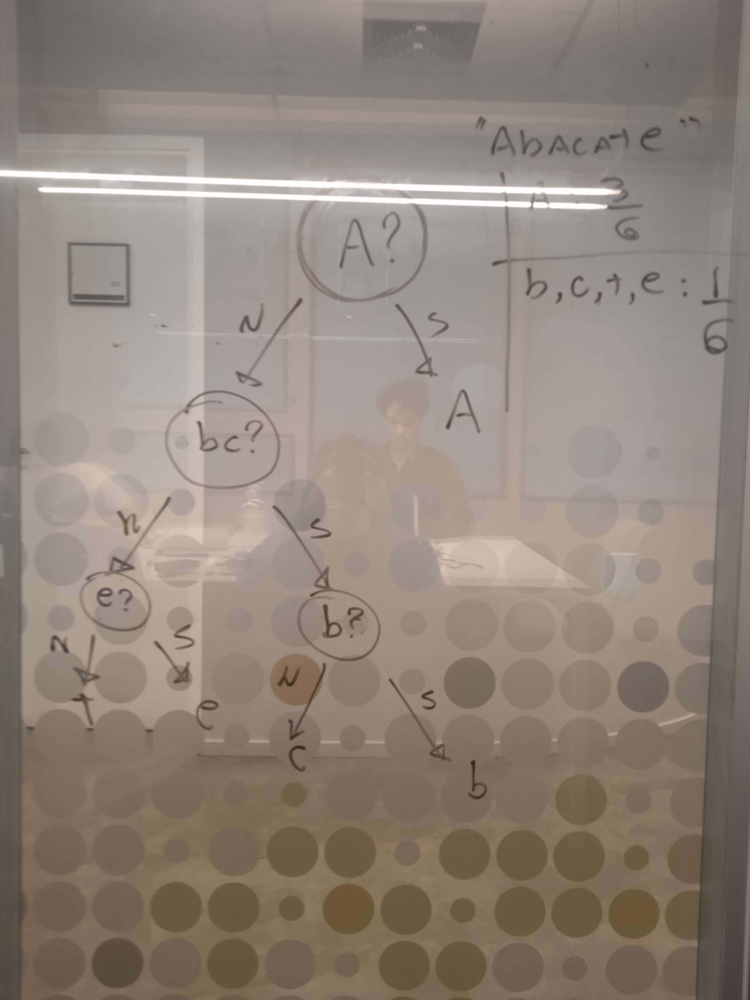
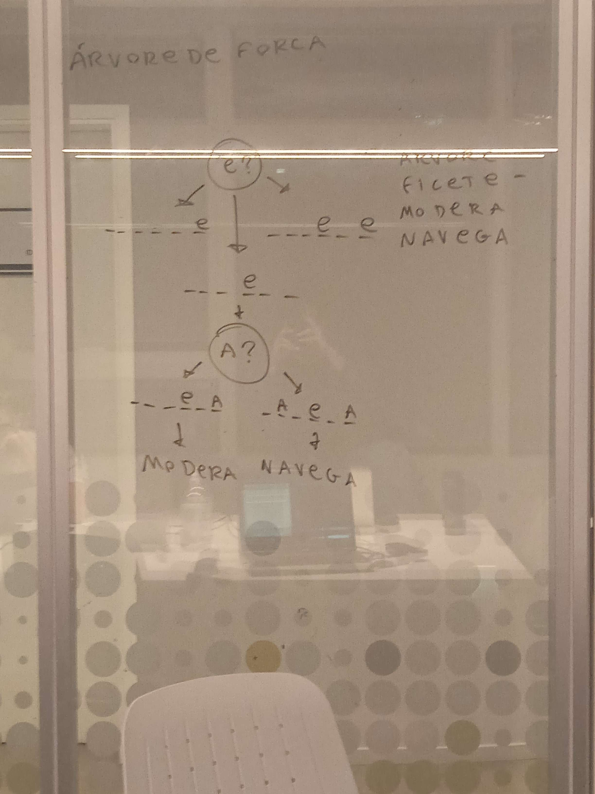

# Sobre o jogador

- Joga a letra com maior probabilidade de acerto,

- Remove possibilidades com base na letra **estar** ou **não** presente na palavra. Caso ela esteja, ganhamos informação e reduzimos a quantidade de palavras possíveis, sem perder vidas, caso não, reduzimos a quantidade de possibilidades pelo máximo possível naquele cenário.

- Eventualmente reduz o universo de probabilidades o bastante para sobrar apenas uma, ou

- Caso suas vidas acabem antes disso, chuta uma palavra aleátoria dentre aquelas que são prováveis.

# Similaridades com a Árvore de Huffman

Quando levamos em conta informações reduziveis a 'sim' ou 'não', como no nosso caso 'a letra **estar** ou **não** presente na palavra', podemos usar parte da lógica da Árvore de Huffman para demonstrar o funcionamento do sistema. 

Esta lógica, em termos simples, hierarquiza 'perguntas' e registra suas 'respostas' de forma binária, afim de minimizar o uso de bits para representar dados, comulmente caracteres.

Por exemplo, a árvore de huffman para a palavra 'abacate' ficaria como a seguir:

- Uma letra/conjunto seguida de interrogação simboliza a pergunta "é esta letra/conjunto?"
- "N" e "S" equivalem as respostas sim ou não a pergunta de cima.

Observe que, apesar de normalmente construirmos essa árvore de baixo para cima, a navegamos no sentido contrário para fazermos perguntas, o que nos garante o máximo de informação para aquela ação.

Essa redução de passos e aumento de ganho de informações se deve principalmente a relação da árvore de huffman com o conceito de entropia - A divisão da hierarquia agrupa os casos menos prováveis e os demarca como não sendo o caso mais provável, aumentando a entropia do sistema a nos niveis inferiores da arvore.

Isso acontece pela entropia ser uma medida de incerteza, que aumenta quando nossas probabilidades estão bem distribuidas dentro do sistema, como nós dividimos ou agrupamos a informação em partes mais próximas entre sí, fizemos com que adquirir uma unica informação tenha maior impacto no conhecimento do sistema como um todo.

No nosso caso, seguir a ordem da hierarquia servirá para maximizarmos nosso ganho de informação a cada tentativa, verificando se a letra está presente a partir de um ponto de menor entropia, buscando aumentar a entropia do passo seguinte.

# O algoritmo

Por fim, quando aplicamos a lógica da arvore de huffman na implementação do nosso algoritmo, obtemos uma árvore similar a esta:

- Nesse caso, assumimos que havia somente quatro palavras possíveis restantes: "arvore", "modera", "navega" e "filete".

Dentro do código, não precisamos nos preocupar com a aparencia ou informações da árvore depois do passo que estamos, pois é preciso apenas filtrar nossas possibilidades entre "contêm letra mais frequente" ou não.

Essa ação por conta do funcionamento do jogo, irá aumentar nossa entropia consideravelmente  por remover a letra mais comum dos calculos futuros, reduzindo casos possíveis ainda mais ou apenas não custa vidas para ser realizada, ainda obtends a informação de onde está a letra em questão na palavra, o que tambem auxilia na redução de casos possíveis.

Por fim, pode-se concluir que ao utilizarmos uma lógica similar a da arvore e hufman na implementação do nosso algoritmo, buscamos maximizar a entropia dos passos futuros do nosso agente enquanto conseguiamos alta prioridade para ocorrências comuns, o que ultimamente gerou a prcisão registrada na demonstração.

## Caso haja dúvidas quanto a implementação aqui descrita, vide `demo.py`